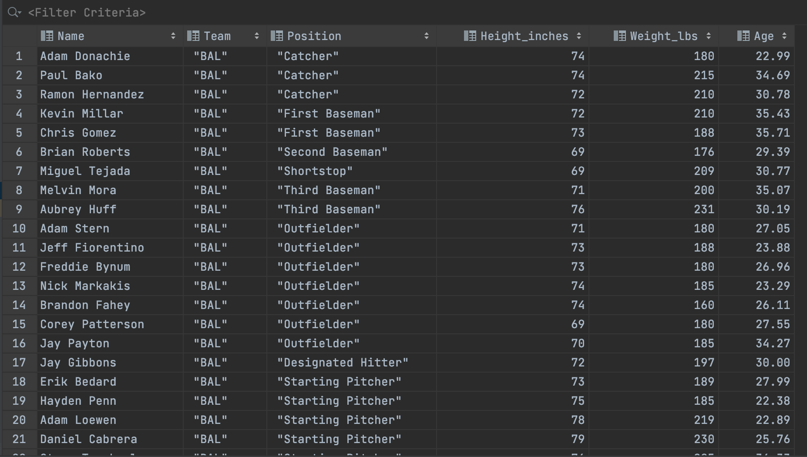
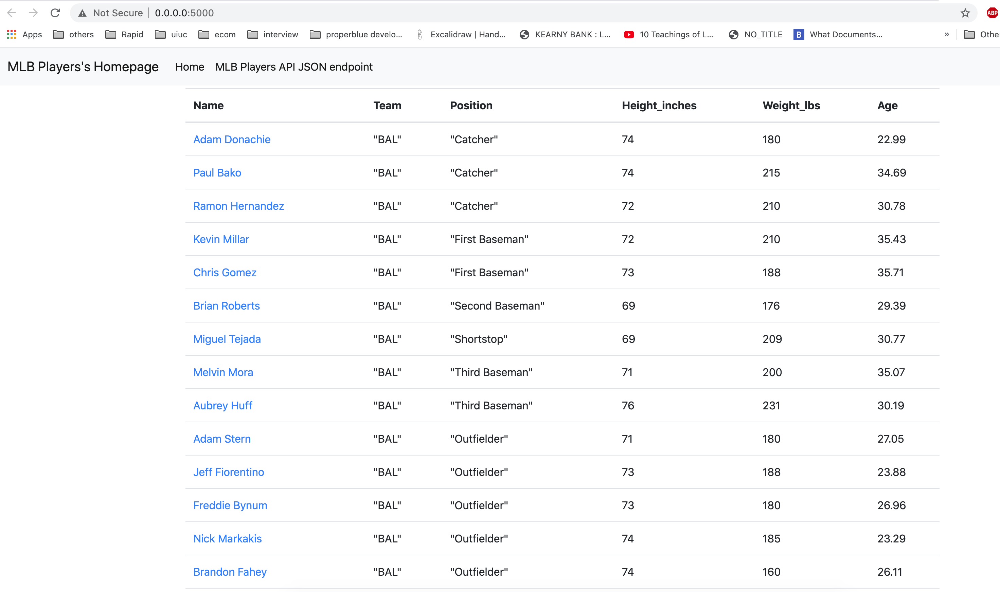
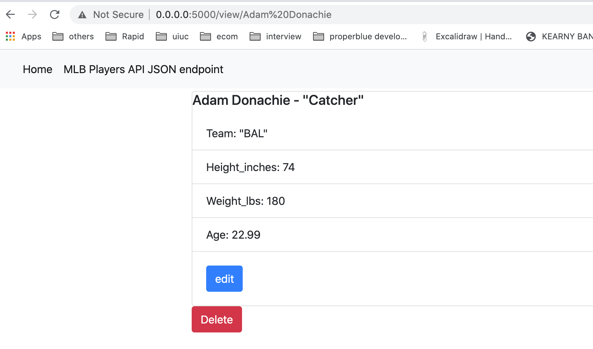
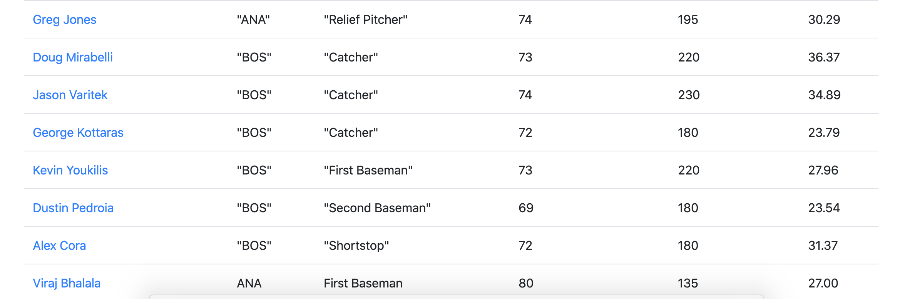
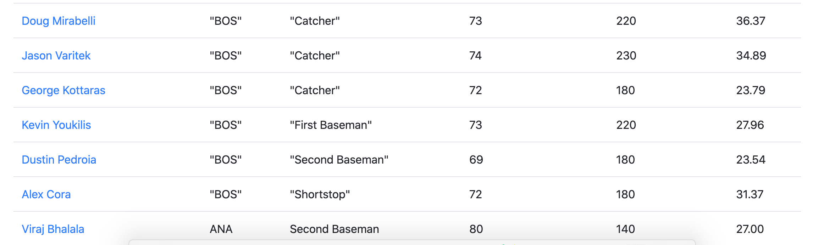
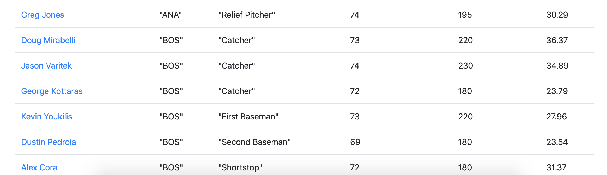

# Project Description
This project contains information about flask forms introduction.

# Data table in Pycharm

# Browser displaying homepage with data

# Browser displaying data record as a view of one record

# New record added to home page

# Updated record added to homepage

# Deleted record added to homepage
