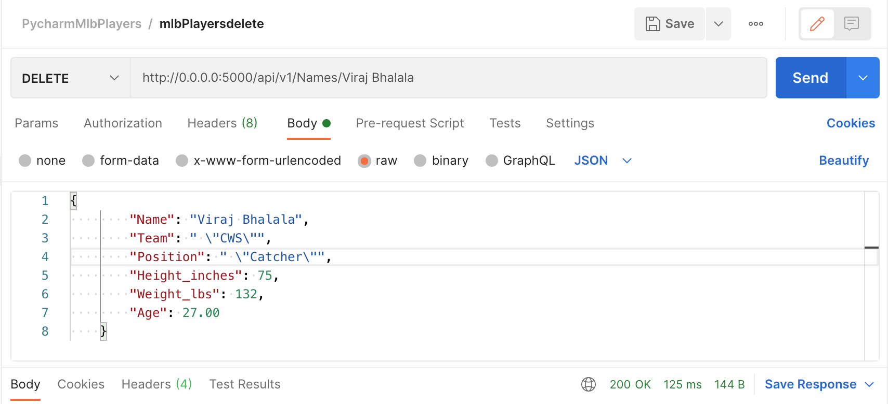

# Project Description
This project contains information about flask forms introduction.

# Data table in Pycharm

# Browser displaying homepage with data

# Browser displaying data record as a view of one record

# New record added to home page

# Updated record added to homepage

# Deleted record added to homepage

# Web Application Part / Final - Individual Project Description
In this project I have created a REST API and use Postman to test the GET, POST, PUT, and DELETE request methods.

# Postman listing all records

# Postman showing one record with a get request

# Postman creating a record by showing the post request

# Postman post request result

# Postman edit a record by showing the put request

# Postman put request result

# Postman delete a record by showing the delete request

# Postman delete request result
